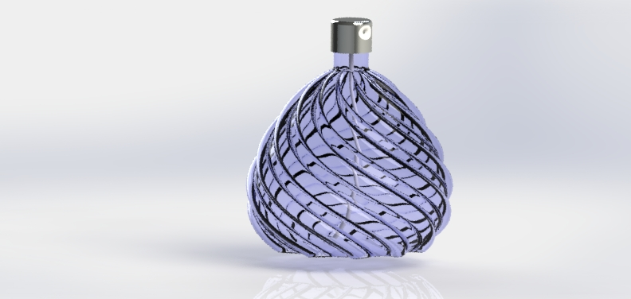

# Sonal Chibire 
Mechanical Engineer (CAE | FEA | Computational Mechanics)

📧 sonalchibire2202@gmail.com  
🔗 [LinkedIn](https://linkedin.com/in/sonal-chibire-792150176)

---

## About Me

Hello! I'm Sonal Chibire, a passionate and innovative Mechanical Engineer dedicated to developing sustainable and efficient solutions. I invite you to explore my portfolio and learn more about my experiences and projects.
Feel free to connect!

---

## Technical Skills

**Simulation & CAE:** Abaqus, ANSYS Fluent, Mechanical, APDL, LS-DYNA, Hyperworks    
**Programming:** Python, MATLAB   
**CAD:** SolidWorks, Creo, CATIA, Inventor, AutoCAD   
**Data & Tools:** LabVIEW, Minitab, Tableau, GD&T (ASME Y14.5), FMEA, Neural Networks   

---

## Featured Projects

**ASTM E399 Fracture Toughness in MATLAB — Load–CMOD → KIC**  
- Recreated ASTM E399 methodology computationally to determine P_Q via the 2% secant method, compute K_Q, and visualize Mode I crack-tip fields.
- Built K-contour maps for validity domains (a/W, load) and linked outcomes to design confidence. 
- Qualified example: P_Q = 9.45 kN, K_Q = 40.82 MPa√m (valid per E399 criteria).
 
*Tools:* MATLAB, Excel; *Standards:* ASTM E399/E1820

*Outcome:* Turned test traces into defensible K-values with clear acceptance criteria and engineering implications.

  
   
  <em>Mode 1 Crack tip sigma_yy field</em>

  
   
  <em>K contours vs a_W and load with ASTM E399 valid region</em>

  
   
  <em>2% secant methos on C(T) specimen</em>

**ASME Section VIII, Division 2 — Design‑by‑Analysis (DBA) via MATLAB**  
 - Modeled a pressurized steel cylinder with Lame’s thick‑wall equations and performed Annex 5‑A stress linearization to separate membrane (P_m) and bending (P_b). 
 - Demonstrated alignment between analytical DBA results and code allowables (e.g., P_m = 125 MPa ≤ S_m = 173 MPa; P_m + P_b = 127.5 MPa ≤ 1.5S_m = 260 MPa), and compared with Design‑by‑Rule (thin‑wall) to show conservative vs. physics‑based behavior.

*Tools:* MATLAB; Code: ASME BPVC VIII‑2 (Annex 5‑A)

*Outcome:* Translated code philosophy into computation, visualizing stress distributions and margins of safety.

  
   
  <em>Thick wall solution vs DBR hoop stress</em>

  
   
  <em>Stress linearization(Hoop)</em>

**Axisymmetric SHPB Single‑Specimen Study — PDE (Navier–Cauchy), ANSYS, and PINN**  
- Built a single‑specimen, axisymmetric elastodynamic model (small‑strain Navier–Cauchy) with traction‑free curved surface, axis regularity at r=0, and specimen‑end boundary conditions.
- Solved numerically in ANSYS Explicit Dynamics to extract time‑series boundary data (incident/transmitted radial lines and centerline axial trace).
- Then trained a Physics‑Informed Neural Network that enforces the same PDE and uses the ANSYS time series as BC constraints to infer the full spatiotemporal displacement and stress fields inside the specimen.
- The PINN utility script produces:
  (1) radial‑displacement time series u_r(t) at multiple radii for a chosen axial station; 
  (2) axial‑displacement time series u_x(t) along the centerline at multiple x;
    (3) optional 2D contours u_r(r,t)|_{x=const} and u_x(x,t)|_{r=const}. Sign‑convention toggles ensure the first lobe polarity matches the impact direction.
- The trained solution captures 2–3 wave crests/troughs consistent with ANSYS histories and expected arrival times.
  
*Tools:* ANSYS Explicit Dynamics (boundary histories), TensorFlow PINN, MATLAB (pre/post)

*Outcome:* A PDE‑faithful field reconstruction across (r, x, t) that agrees with ANSYS BCs and reveals interior dynamics.
 

  
   
  <em>u_x vs t</em>

  
   
  <em>u_r vs t</em>

 

## Projects

**Self-Intiated Design Projects**  
- Engaged in various personal projects using SolidWorks to enhance 3D modeling skills.
- Focused on learning and experimenting with advanced CAD techniques and design principles.
- Further developed proficiency in SolidWorks through hands-on experience.

  
   
  

---

## Experience

**Larsen & Toubro Heavy Engineering (Internship)**

- *Project:* Optimized the thickness of the Hydraulic Block Manifold to reduce weight while maintaining robustness.

- *Tools:* SolidWorks and Ansys Workbench.

- *Responsibilities:*
  1. Designed and simulated the manifold using SolidWorks and Ansys Workbench.
  2. Validated the results against ASME-BPVC standards.
  3. Achieved weight reduction without compromising structural integrity.

**Apar Industries Ltd (Oil and Gas Division) (Internship)**

- *Project:* Improved turbulence intensity and flow distribution in industrial oil blenders.
  
- *Tools:* Ansys Fluent
  
- *Responsibilities:*
  1. Implemented high-efficiency impellers, resulting in a 40% improvement in turbulence intensity and better flow distribution.
  2. Redesigned baffle plates in existing industrial oil blenders, achieving a 13–17% reduction in oil blending time.
  3. Conducted CFD analysis using Ansys Fluent to optimize designs.

**Dembla Valves Ltd. (Design Engineer)**

*Responsibilities:*
- Addressed complex challenges in globe and butterfly valves, focusing on enhancing pressure ratings and sealing capabilities.
- Utilized experimental methods and finite element analysis (FEA) with Ansys Workbench.
- Led modeling and structural strength analyses of valve components under diverse operating conditions, ensuring robust and efficient designs.
- Managed General Assembly (GA) drawings, Bills of Materials (BOM), and ERP processes.
- Created detailed designs for valve assemblies and patterns, including investment casting and forging.
- Ensured compliance with industry standards such as ANSI B16.34, ANSI B16.5, API 6D, and ANSI B16.10.

---

## Research 

**Evaluation of Fracture Toughness of Precracked Steel Specimen Using Split Hopkinson Pressure Bar**

- Conducted research at Bhabha Atomic Research Center, Mumbai, India.
- Utilized the Split-Hopkinson Pressure Bar (SHPB) for dynamic three-point bending tests to measure fracture toughness at high strain rates (102–104 s−1).
- Recorded strain rates of pre-cracked specimens using strain gauges on incident and transmitted bars.
- Performed simulation studies using 3D models of the SHPB setup and specimen, analyzed with ANSYS©.
- Conducted transient dynamic analysis to simulate high strain rates and compared results with experimental data to calculate fracture toughness.
-
- Publication: 
 [Evaluation of Fracture Toughness of Steel using Split Hopkinson Pressure Bar
](https://link.springer.com/chapter/10.1007/978-981-15-4779-9_42 )

---

## Education

**M.S. Mechanical Engineering**  
Northern Illinois University (2024–2026)  
Thesis: *Modeling Wave Propagation in Bi-Material Systems Using Analytical, Numerical, and PINN Approaches*  
• Developed and validated elastodynamic (Navier–Lamé equations) FEA models using MATLAB, ANSYS, and Physics Informed Neural Network.
• Investigated mechanical robustness of multi-material interfaces under high-rate loading

**M.E. Machine Design**  
University of Mumbai (2017-2019)
Thesis: *Evaluation of Fracture Toughness of Pre-Cracked Steel Using Split Hopkinson Pressure Bar*
• Designed and validated high strain-rate test systems (10²–10⁴ s⁻¹) aligned with ASTM E399 / E1820
• Correlated experimental and numerical results within 5% accuracy

**B.E. Mechanical Engineering**  
University of Mumbai  

---

## Achievements and Presentations
•	Presented at the 3rd International Conference and Exhibition on Fatigue, Durability, and Fracture Mechanics (2019) | VTU Belagavi, Karnataka, India
•	Presented at the National Finite Element Developers/FEAST SMT Users (2019) | DAE Convention Center, Bhabha Atomic Research Center, Mumbai, India

---
## Clubs and Leadership

•	*Vice-President | Society of Asian Scientists and Engineers (SASE-International)*
- Led initiatives to support Asian STEM students in academic and professional development.
 
•	*Member | Society of Women Engineers (SWE), Indian Student Association (ISA), Brazilian Jiu-Jitsu Club*
- Participated in events that promote diversity, inclusion, and community engagement.

•	*Athletic Achievement*
- National-Level Taekwondo Player (Black Belt - India)
- Competed at the national level, demonstrating discipline and excellence in martial arts.

• Member of Pi Tau Sigma Mechanical Engineering Honor Society, Phi Beta Delta Honor Society - Zeta Gamma Chapter  

• Ansys Professional and Associate Certified

---

## Resume

👉 ./resume/Sonal_Chibire_Resume.pdf  

---

## Contact

For collaboration or opportunities, 
feel free to connect via LinkedIn or email.

---
